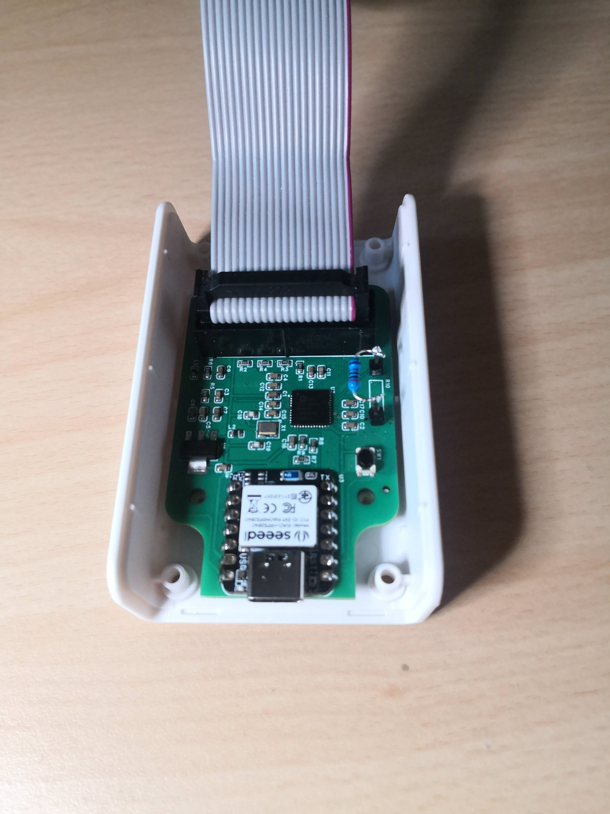

# ad594x-experiments

## Overview
This repository contains experiments and examples for working with the AD594x series. Seeed Studio XIAO nRF52840 is used as a bridge to AD594x. It allows reading and writing values AD594x registers via JSON-RPC over serial. For details, please check the examples folder.

### C Examples (`c_examples/`)
- **example_impedance/**: Contains impedance measurement example.
- **example_rtia/**: Contains RTIA measurement example.
- **test/**: Test cases for the C examples.

### JavaScript Example (`js_example/`)
- **main.js/**: Contains test and RTIA measurement example.

